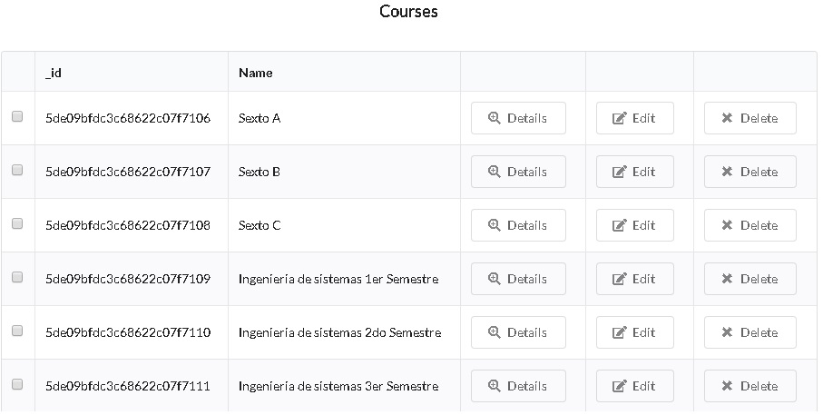

# javascript-react-edu-se

This project was bootstrapped with [Create React App](https://github.com/facebookincubator/create-react-app).

## Prerequisites

1. Install Windows 10
2. Install node.js version 10.16.3
3. Install npm version 6.9.0
4. Install google Chrome 64 Bits Version 64.0

## Deploy

1. Do git clone from: https://github.com/RichardSeverich/javascript-react-edu
2. Install dependencies: npm install
3. Deploy: npm start
4. Deploy will start with mock data.
5. Default credentials are: User: admin, Password: admin123

## Documentation

### Diagram-architecture

### Diagram-entity-relation

### Redux Work Flow

### Component

## Screens

### Login

### Users Form

### Users Table

### Courses Form

### Courses Table

### Module Form

### Module Table

